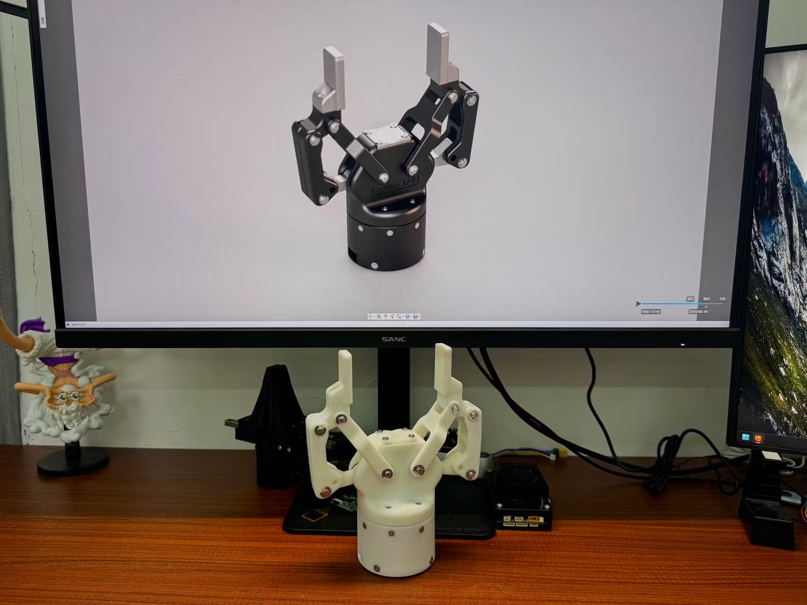

# RhinoV2.0 自适应夹爪



---

**[English](#english) | [中文](#中文)**

---

<a name="中文"></a>

## 中文说明

### 项目简介

RhinoV2.0 是一款开源的自适应两指夹爪，设计灵感来源于 Robotiq 2F-85 商用夹爪。本项目旨在提供一款低成本、高性能、易于制造和组装的机械夹爪解决方案，让更多机器人爱好者、学生和个人开发者能够用上经济实惠的末端执行器。

### 项目初衷

- **降低门槛**：商业夹爪价格高昂（如 Robotiq 2F-85 售价约 $2000+），我们希望让更多人用得起
- **开源共享**：所有设计文件完全开源，支持自由修改和优化
- **教育价值**：为机械工程、机器人专业的同学提供学习和参考的设计案例
- **可制造性**：采用标准件+通用加工工艺，降低制造成本
- **可扩展性**：设计模块化，便于二次开发和改进

### 主要特点

- 自适应夹持，可兼容不同形状和尺寸的物体
- 欠驱动机构设计，结构紧凑
- 采用关节电机（达妙 DM4310）驱动
- 支持 FDM 3D打印或 CNC 加工
- 完整的 SolidWorks 源文件和 STEP 通用格式

### 文件结构

```
RhinoV2.0_Gripper/
├── 0_Solidworks2025/          # SolidWorks 2025 源文件
│   ├── RhinoV2.0_Assembly.SLDASM   # 总装配体
│   ├── DM4310.SLDPRT               # 关节电机模型
│   └── ...                         # 所有零件模型
│
├── 1_STEP/                         # STEP 通用格式文件
│   └── RhinoV2.0_Assembly.STEP     # 完整装配体 STEP 文件
│
├── 2_Bom/                          # 物料清单与加工文件
│   ├── BOM.xlsx                    # 总物料清单
│   ├── FDM或CNC/                   # 可3D打印或 CNC 的零件
│   ├── 嘉立创钣金304或铨洲/          # 钣金件或CNC加工文件
│   ├── 铨洲三轴CNC/                 # CNC 加工文件
│   └── 丝杆及螺母/                  # 丝杆组件相关
│
├── img/                            # 项目图片
│   └── RhinoV2.0_Real.jpg          # 实物图
│
├── README.md                  # 本文件
└── LICENSE                    # MIT 开源许可证
```

### 硬件配置

| 项目 | 参数 |
|------------|---------------------|
| 驱动电机 | 达妙 DM4310 关节电机 |
| 夹持行程 | (待补充) |
| 最大夹持力 | (待补充) |
| 重量 | (待补充) |
| 加工方式 | FDM 3D打印 / CNC / 钣金 |

### 快速开始

#### 1. 获取设计文件

- **SolidWorks 用户**：直接使用 `0_Solidworks2025/` 中的源文件进行修改
- **其他 CAD 软件**：导入 `1_STEP/RhinoV2.0_Assembly.STEP` 文件

#### 2. 零件加工

参考 `2_Bom/` 目录下的详细清单：
- 可 3D 打印零件列表
- CNC 加工图纸
- 钣金件加工文件
- 标准件采购清单（轴承、螺丝等）

> 💡 **学生党福利**：如果您觉得结构件或丝杆价格昂贵，欢迎联系我们组织拼单购买，多人一起可以降低成本！

#### 3. 组装

(详细的组装教程视频/文档即将推出)

### 贡献指南

我们欢迎任何形式的贡献：

- 报告 Bug
- 提出新功能建议
- 提交设计改进
- 完善文档
- 分享您的制作成果

**有意向加入团队？**

如果您对这个项目充满热情，希望加入我们的团队一起开发更好的夹爪，欢迎通过上述联系方式（邮箱或微信）与我们联系！我们期待您的加入！

### 许可证

本项目采用 [MIT License](LICENSE) 开源协议，您可以自由使用、修改和分发。

### 致谢

- 设计灵感来源于 [Robotiq 2F-85](https://robotiq.com/products/2f85-140-adaptive-robot-gripper)
- 感谢所有为本项目做出贡献的开发者

**特别鸣谢 / Special Thanks**

- **小一** - 感谢您的赞助支持 | GitHub: [KelvinLauMiau](https://github.com/KelvinLauMiau)
- **乐乐汉堡** - 感谢您的激励和指导 | Bilibili: [乐乐汉堡](https://space.bilibili.com/435723766?spm_id_from=333.337.0.0)

### 联系方式

- 作者：wEch1ng
- 前代项目：[RhinoV1.0_Gripper](https://github.com/wEch1ng/Rhino_Gripper) （本项目的升级改进版本）
- 邮箱：3575868884@qq.com
- 微信：xwccc12028
- 如有问题或合作意向，欢迎联系！

---

**如果这个项目对您有帮助，请给一个 Star ⭐**

---

**[回到顶部](#rhinov20-自适应夹爪) | [English](#english)**

---

<a name="english"></a>

## English Documentation

### Introduction

RhinoV2.0 is an open-source adaptive two-finger gripper, inspired by the commercial Robotiq 2F-85 gripper. This project aims to provide a low-cost, high-performance, and easy-to-manufacture robotic gripper solution, making end-effectors accessible to more robotics enthusiasts, students, and individual developers.

### Project Motivation

- **Accessibility**: Commercial grippers are expensive (e.g., Robotiq 2F-85 costs around $2000+), we aim to make them affordable
- **Open Source**: All design files are fully open-source, supporting free modification and optimization
- **Educational Value**: Provides design references for mechanical engineering and robotics students
- **Manufacturability**: Uses standard parts and common manufacturing processes to reduce cost
- **Extensibility**: Modular design facilitates secondary development and improvements

### Key Features

- Adaptive gripping compatible with objects of various shapes and sizes
- Underactuated mechanism design with compact structure
- Joint motor (DAMIAO DM4310) driven
- Supports FDM 3D printing or CNC machining
- Complete SolidWorks source files and STEP universal format

### File Structure

```
RhinoV2.0_Gripper/
├── 0_Solidworks2025/          # SolidWorks 2025 source files
│   ├── RhinoV2.0_Assembly.SLDASM   # Main assembly
│   ├── DM4310.SLDPRT              # Joint motor model
│   └── ...                        # All part models
│
├── 1_STEP/                    # STEP universal format files
│   └── RhinoV2.0_Assembly.STEP    # Complete assembly STEP file
│
├── 2_Bom/                     # Bill of materials and manufacturing files
│   ├── BOM.xlsx                    # Total BOM list
│   ├── FDM或CNC/                   # FDM 3D printing or CNC parts
│   ├── 嘉立创钣金304或铨洲/         # Sheet metal fabrication or CNC files
│   ├── 铨洲三轴CNC/                 # CNC machining files
│   └── 丝杆及螺母/                  # Lead screw assembly related
│
├── img/                       # Project images
│   └── RhinoV2.0_Real.jpg          # Photo of real product
│
├── README.md                  # This file
└── LICENSE                    # MIT open source license
```

### Hardware Specifications

| Item | Specification |
|------------|---------------------|
| Motor | DAMIAO DM4310 Joint Motor |
| Gripping Stroke | (TBD) |
| Max Gripping Force | (TBD) |
| Weight | (TBD) |
| Manufacturing | FDM 3D printing / CNC / Sheet metal |

### Quick Start

#### 1. Obtain Design Files

- **For SolidWorks Users**: Use source files in `0_Solidworks2025/` directly for modification
- **For Other CAD Software**: Import `1_STEP/RhinoV2.0_Assembly.STEP` file

#### 2. Parts Manufacturing

Refer to detailed lists in `2_Bom/` directory:
- 3D printable parts list
- CNC machining drawings
- Sheet metal fabrication files
- Standard parts procurement list (bearings, screws, etc.)

> 💡 **For Students**: If you find structural parts or lead screws expensive, feel free to contact us to organize group purchases. Buying together can reduce costs significantly!

#### 3. Assembly

(Detailed assembly tutorial video/documentation coming soon)

### Contributing

We welcome contributions in any form:

- Bug reports
- Feature requests
- Design improvements
- Documentation enhancements
- Share your build

**Interested in Joining the Team?**

If you are passionate about this project and want to join our team to develop better grippers together, please feel free to contact us via email or WeChat listed above. We look forward to having you!

### License

This project is licensed under the [MIT License](LICENSE).

### Acknowledgments

- Design inspired by [Robotiq 2F-85](https://robotiq.com/products/2f85-140-adaptive-robot-gripper)
- Thanks to all developers who contributed to this project

**Special Thanks**

- **小一** - Thank you for your sponsorship | GitHub: [KelvinLauMiau](https://github.com/KelvinLauMiau)
- **乐乐汉堡** - Thank you for your motivation and guidance | Bilibili: [乐乐汉堡](https://space.bilibili.com/435723766?spm_id_from=333.337.0.0)

### Contact

- Author: wEch1ng
- Previous Project: [RhinoV1.0_Gripper](https://github.com/wEch1ng/Rhino_Gripper) (This is an upgraded version)
- Email: 3575868884@qq.com
- WeChat: xwccc12028
- Feel free to contact for any questions or collaboration!

---

**If this project helps you, please give it a Star ⭐**

---

**[Back to Top](#rhinov20-自适应夹爪) | [中文](#中文)**
